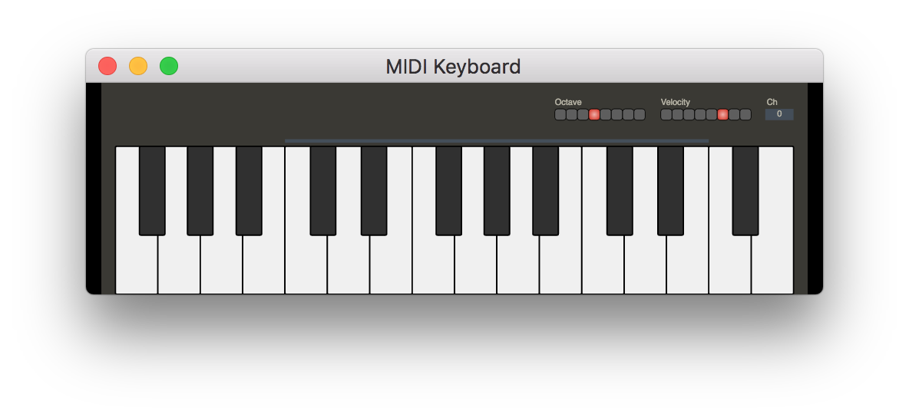
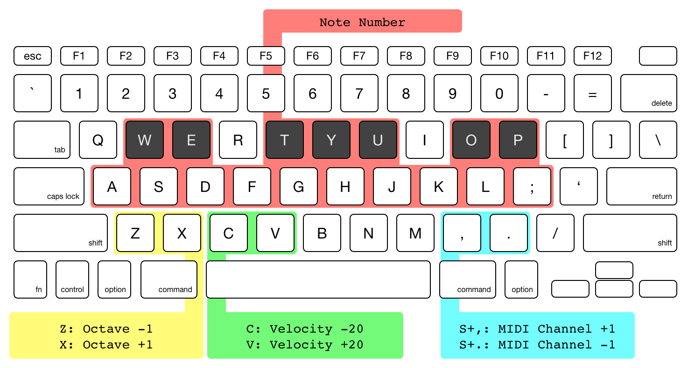

# Virtual MIDI Keyboard

Electron-based Virtual MIDI Keyboard



## Installation

```
$ git clone https://github.com/mohayonao/virtual-midi-keyboard.git
$ cd virtual-midi-keyboard
$ npm install
```

## Run

```
$ npm start
```

### ...with Web Based App

If set the environment variable `PORT`, you can use the web based app. In the web based app with a tablet, you would get the UX that is closer to a hardware MIDI Device.

```
$ PORT=7700 npm start
```

## Keyboard Layout



## License

MIT
